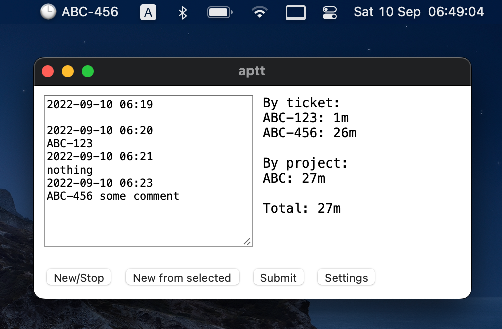

# A perfect time tracker

A desktop app for tracking time and submitting time logs to Jira via Tempo REST
API. MacOS only.

## Required permissions

- `Input Monitoring` - to make the `cmd+c+c` shortcut work

## Installation

- Download the [latest release](https://github.com/Leksat/aptt/releases/latest)
- Install the app as usual
- Go to `Systems Settings > Security & Privacy`
- Grant the [required permissions](#required-permissions) to the app

## Upgrade

- Go to `Systems Settings > Security & Privacy`
- Remove all permissions granted to the app
- Follow the [installation instructions](#installation)

## Overview



In the app the time entries are stored as text. Example:

```
2022-09-10 06:19

2022-09-10 06:20
ABC-123
2022-09-10 06:21
nothing
2022-09-10 06:23
ABC-456 some comment
```

The above means:

- for one minute I did something unknown
- for the next minute I worked on a Jira issue ABC-123
- for the next two minutes I did nothing (and I mentioned this specifically)
- starting from 2022-09-10 06:23 and till the current moment I'm working on
  ABC-456 (and I added `some comment`)

On Submit:

- ABC-123 will be logged to Jira
- the last entry will stay, it won't be logged because it's an active one
- everything else will disappear

## Global hotkeys

- `cmd+c+c`: copy selected text to clipboard, search the clipboard contents for
  a Jira issue, start a new entry if it was found
- `cmd+c+c+c`: same as the above but also focuses the app
- `cmd+alt+x`: focus the app
